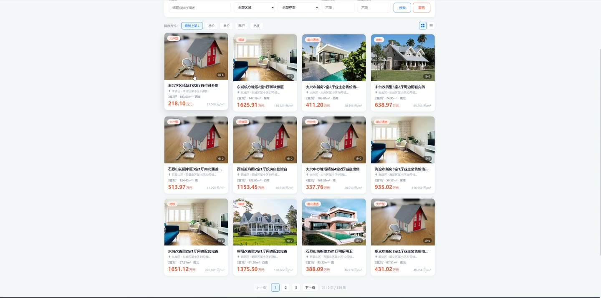
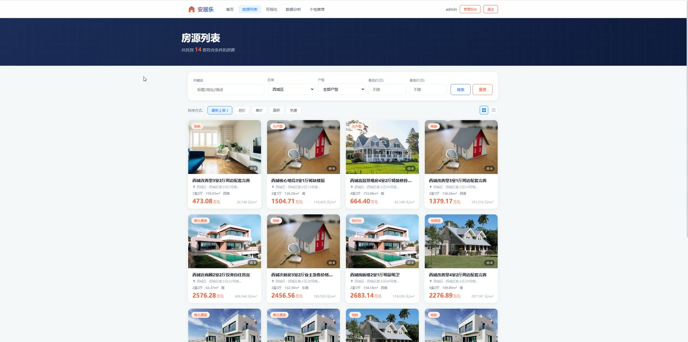
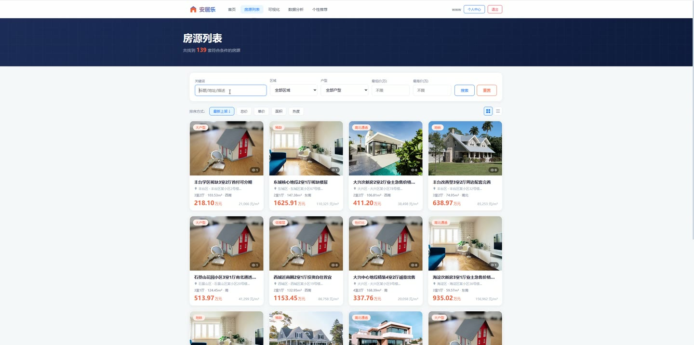
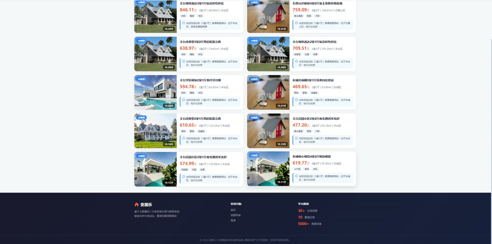
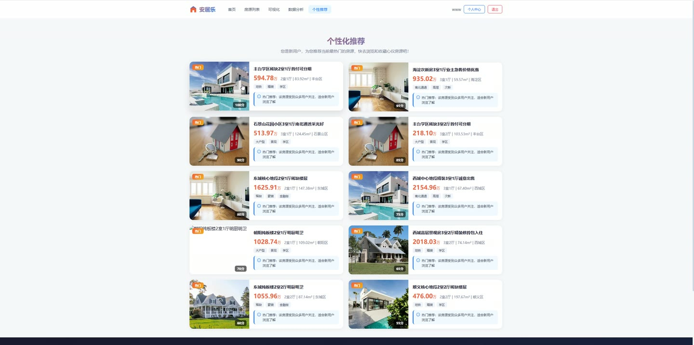
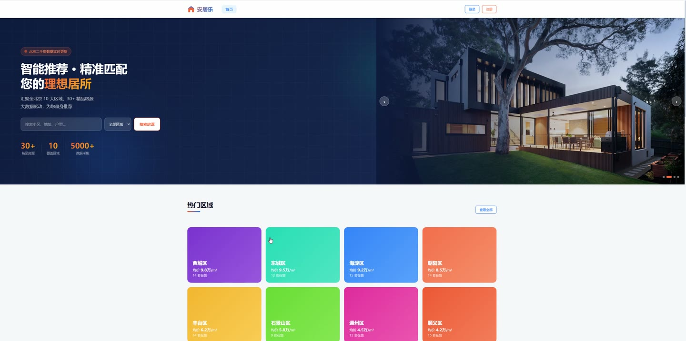

# (附文档)Python+Flask+Vue3 基于Flask二手房的交易与推荐系统

**技术栈**：Python、Flask、机器学习、Vue3、MySQL

### 系统简介

本系统是一套基于 Flask + Vue3 的二手房交易与推荐平台，采用前后端分离架构，后端提供 RESTful API，前端为单页应用。系统包含普通用户端与管理员端两类角色，围绕房源浏览、收藏、数据采集、统计分析与协同过滤推荐构建完整业务闭环。
 
### 核心功能
 
### 普通用户端

 
- 用户注册：填写用户名、密码、邮箱、手机号完成账号创建，注册成功自动登录并写入 Token。 
- 用户登录：支持用户名密码登录，登录后按角色跳转首页或管理后台，并提供管理员与普通用户快速体验入口。 
- 浏览首页：展示平台房源入口与推荐内容，未登录用户可访问首页。 
- 房源列表：进入房源列表页，支持按条件筛选与分页浏览在售房源。 
- 房源详情：查看房源标题、总价、面积、户型、楼层、朝向、装修、建成年份、地址、标签、描述与封面图，浏览时累计浏览次数。 
- 收藏房源：在详情页收藏心仪房源，收藏行为参与推荐评分计算。 
- 个人中心：查看与维护个人账号信息，管理自己的收藏记录。 
- 我的收藏：在收藏页集中查看已收藏房源列表。 
- 个性化推荐：进入推荐页获取基于协同过滤生成的 Top-N 房源推荐列表。 
- 数据可视化：在前台可视化页查看区域房价分布等图表。 
- 前台数据分析：查看面积与总价关系、区域价格分布等分析结果。
 
### 管理员端

 
- 数据看板：查看在售房源数、注册用户数、收藏次数、总浏览次数等统计卡片。 
- 热门房源 TOP5：按浏览量展示排名前五的房源及区域、价格、浏览数。 
- 采集记录概览：展示最近采集记录的数据来源、状态、成功与失败数量及时间。 
- 快捷操作：一键跳转新增房源、用户管理、数据分析，并可立即触发数据采集。 
- 房源管理：按标题/地址关键字与状态筛选房源，分页查看封面、区域、价格、面积、户型、状态、浏览、来源。 
- 新增房源：录入标题、总价、面积、户型、区域、楼层、朝向、装修、建成年份、状态、地址、标签、封面图与描述。 
- 编辑房源：修改已有房源的上述全部字段并保存。 
- 删除房源：对指定房源执行删除操作。 
- 封面上传：支持填写图片 URL 或上传本地图片作为房源封面并预览。 
- 用户管理：按用户名/邮箱/手机与角色筛选用户，分页查看 ID、用户名、邮箱、手机、角色、状态与注册时间。 
- 用户状态控制：对普通用户执行禁用或启用操作，管理员账号不可禁用。 
- 删除用户：对普通用户执行删除操作。 
- 数据采集配置：选择数据来源、目标区域、请求频率、反爬策略与采集条数。 
- 启动采集：执行采集任务并实时展示进度条与总发现、成功、失败数量结果。 
- 采集日志管理：分页查看采集日志的来源、总数、成功、失败、状态、时间与备注，支持单条删除与清空全部。 
- 描述性统计：查看各区域房源数、均价、中位数、标准差、最低价、Q1、Q3、最高价、IQR、均面积与均单价。 
- 相关性分析：查看价格、面积等特征间的 Pearson 相关系数矩阵热力图。 
- 区域价格热力图：查看区域与价格段交叉的房源数量分布。 
- 线性回归分析：查看面积到总价的回归方程、R² 拟合优度与 MAE 平均绝对误差及散点回归图。 
- K-Means 聚类：查看房源市场分层聚类结果、各簇数量、均价、均面积与价格区间及聚类中心。 
- 推荐策略配置：设置浏览权重、收藏权重、相似度算法、Top-N 数量、冷启动策略与最少交互数。 
- 生成推荐：一键触发推荐计算，查看覆盖用户数、涉及房源数与生成推荐条数。
 
### 技术栈

 后端框架Python + Flask 认证鉴权Flask-JWT-Extended + 角色权限校验 跨域处理Flask-CORS 数据库MySQL（PyMySQL 驱动，DictCursor） 推荐算法Item-based 协同过滤 + 余弦相似度 数据分析描述性统计、Pearson 相关性、线性回归、K-Means 聚类 前端框架Vue3（Composition API + script setup） 状态管理Pinia 路由Vue Router（含登录与管理员路由守卫） 图表可视化ECharts 构建工具Vite
 
### 交付内容

 
- 后端完整源码 
- 前端完整源码 
- 数据库初始化脚本 
- 万字文档

## 界面展示

---

## 获取完整源码 + 万字文档

本仓库为项目介绍页。**完整前后端源码、数据库初始化脚本、万字项目文档**，请加微信 `kangkangcode`，或访问 [codekk.top](http://codekk.top) 获取。

可作课程设计 / 毕业设计参考，支持远程部署调试。